# Mini ERP API

Production-ready NestJS Backend for the Mini ERP Invoicing System.

## Project Overview
The Mini ERP API provides a robust, microservice-ready backend for managing invoices, customers, and auditing. Built on NestJS and Prisma, it focuses on clean architecture, security, and developer experience.

## Tech Stack
- **Framework**: NestJS 11
- **Database**: PostgreSQL with Prisma ORM
- **Authentication**: JWT with Refresh Tokens & Role-Based Access Control (RBAC)
- **Validation**: class-validator & class-transformer
- **Documentation**: Swagger / OpenAPI

## Architecture & Architectural Decisions
- **Clean Architecture & Repository Pattern**: Business logic is decoupled from data access, allowing for easier testing and future database migrations.
- **Feature-Based Modules**: Each domain (Customers, Invoices, Audit, Auth) is encapsulated within its own module, ensuring a microservice-ready design.
- **ConfigService Integration**: All environment variables are strictly managed through `@nestjs/config` eliminating direct `process.env` usage.

## Features
- **User Authentication**: Secure Login/Logout with JWT and Refresh tokens.
- **Role-Based Access Control**: Granular permissions (e.g., `INVOICE_CREATE`, `USER_READ`) validated via custom guards.
- **Invoice Management**: Complete lifecycle management for invoices (Draft, Sent, Paid).
- **Customer Management**: Centralized customer records.
- **Audit Logs**: Immutable event tracking for critical system actions.

## Database
The system uses PostgreSQL.



## Live Demo & Swagger
- **Backend URL**: [https://mini-erp-invoicing-system-be-production.up.railway.app](https://mini-erp-invoicing-system-be-production.up.railway.app)
- **Swagger Documentation**: [https://mini-erp-invoicing-system-be-production.up.railway.app/docs](https://mini-erp-invoicing-system-be-production.up.railway.app/docs)

## Installation

1. Install dependencies:
```bash
npm install
```

2. Setup environment variables by copying `.env.example` to `.env`.

3. Apply database migrations:
```bash
npx prisma migrate dev
```

4. Seed the database with initial data (roles, admin user, permissions):
```bash
npm run seed
```

5. Run the application:
```bash
npm run start:dev
```

## Environment Variables
The following essential environment variables are required:
- `DATABASE_URL`: Connection string for PostgreSQL database
- `JWT_ACCESS_SECRET`: Secret key for signing access tokens
- `JWT_REFRESH_SECRET`: Secret key for signing refresh tokens
- `JWT_ACCESS_EXPIRES_IN`: Expiration time for access tokens (e.g., `15m`)
- `JWT_REFRESH_EXPIRES_IN`: Expiration time for refresh tokens (e.g., `7d`)

## Folder Structure
```text
src/
├── auth/          # Authentication Module
│   ├── controllers/
│   ├── dto/
│   ├── repositories/
│   ├── services/
│   └── strategies/
├── authorization/ # RBAC, Roles, and Permissions
├── common/        # Global Shared Resources
│   ├── decorators/
│   ├── exceptions/
│   ├── filters/
│   ├── guards/
│   ├── interceptors/
│   ├── middleware/
│   └── utils/
├── config/        # Centralized App Configuration
├── customers/     # Customer Domain Logic
│   ├── controllers/
│   ├── dto/
│   ├── repositories/
│   └── services/
├── dashboard/     # Dashboard Aggregation Logic
├── database/      # Prisma Service and Seeding (seed.ts)
├── invoices/      # Invoice Domain Logic
├── users/         # User Management
└── main.ts        # App Entry Point
```

## Future Improvements
- **Docker**: Enhancing the multi-stage Docker build for even smaller footprint.
- **API Versioning**: Enforcing strict versioning across all clients.
- **CI/CD**: Automating tests and deployment pipelines.
- **Unit Testing**: Expanding code coverage for all services.
- **Integration Testing**: End-to-end flow validation.
- **Monitoring**: Integration with Prometheus/Grafana or Datadog.
- **Caching**: Implementing Redis for frequently accessed data (e.g., Dashboard).
- **Event-driven Architecture**: Decoupling audit logging via message brokers like RabbitMQ or Kafka.
